[](https://gitpod.io/#https://github.com/siva-sankar-a/eva) 

# EVA Assignments
 
# Assignment 4

## Submitted by
    - Siva Sankar Anil Kumar
    - Dinesh Kesaboina
 
### The assignment is divided into 3 Experiments
 
- Experiment 1
   - Strategy
       - Brute force minimization of the number of parameters
       - Introduction of **GAP** layer
   - Architecture
 
       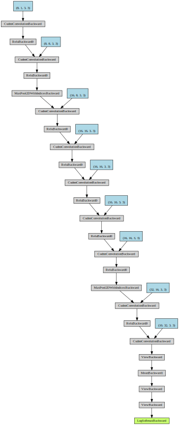
 
   - Logs
       ```
       TRAIN : epoch=0 train_loss=0.03600 correct/total=6330/60000 accuracy=10.6: 100%|██████████| 938/938 [00:22<00:00, 41.71it/s]
       TEST :  epoch=0 test_loss=2.30229 correct/total=980/10000 accuracy=9.8: 100%|██████████| 157/157 [00:03<00:00, 45.71it/s]
       TRAIN : epoch=1 train_loss=0.02464 correct/total=24012/60000 accuracy=40.0: 100%|██████████| 938/938 [00:22<00:00, 41.98it/s]
       TEST :  epoch=1 test_loss=0.41069 correct/total=8779/10000 accuracy=87.8: 100%|██████████|      157/157 [00:03<00:00, 46.81it/s]
       TRAIN : epoch=2 train_loss=0.00340 correct/total=56116/60000 accuracy=93.5: 100%|       ██████████| 938/938 [00:22<00:00, 41.64it/s]
       TEST :  epoch=2 test_loss=0.11479 correct/total=9629/10000 accuracy=96.3: 100%|██████████|      157/157 [00:03<00:00, 46.17it/s]
       TRAIN : epoch=3 train_loss=0.00194 correct/total=57752/60000 accuracy=96.3: 100%|       ██████████| 938/938 [00:22<00:00, 42.17it/s]
       TEST :  epoch=3 test_loss=0.06737 correct/total=9784/10000 accuracy=97.8: 100%|██████████|      157/157 [00:03<00:00, 47.25it/s]
       TRAIN : epoch=4 train_loss=0.00135 correct/total=58414/60000 accuracy=97.4: 100%|       ██████████| 938/938 [00:22<00:00, 42.24it/s]
       TEST :  epoch=4 test_loss=0.05345 correct/total=9849/10000 accuracy=98.5: 100%|██████████|      157/157 [00:03<00:00, 47.20it/s]
       TRAIN : epoch=5 train_loss=0.00108 correct/total=58705/60000 accuracy=97.8: 100%|       ██████████| 938/938 [00:22<00:00, 41.55it/s]
       TEST :  epoch=5 test_loss=0.08425 correct/total=9728/10000 accuracy=97.3: 100%|██████████|      157/157 [00:03<00:00, 46.67it/s]
       TRAIN : epoch=6 train_loss=0.00097 correct/total=58879/60000 accuracy=98.1: 100%|       ██████████| 938/938 [00:22<00:00, 42.20it/s]
       TEST :  epoch=6 test_loss=0.07132 correct/total=9778/10000 accuracy=97.8: 100%|██████████|      157/157 [00:03<00:00, 44.89it/s]
       TRAIN : epoch=7 train_loss=0.00083 correct/total=58996/60000 accuracy=98.3: 100%|       ██████████| 938/938 [00:22<00:00, 41.97it/s]
       TEST :  epoch=7 test_loss=0.03855 correct/total=9877/10000 accuracy=98.8: 100%|██████████|      157/157 [00:03<00:00, 45.47it/s]
       TRAIN : epoch=8 train_loss=0.00073 correct/total=59108/60000 accuracy=98.5: 100%|       ██████████| 938/938 [00:22<00:00, 42.36it/s]
       TEST :  epoch=8 test_loss=0.04076 correct/total=9865/10000 accuracy=98.7: 100%|██████████|      157/157 [00:03<00:00, 47.53it/s]
       TRAIN : epoch=9 train_loss=0.00069 correct/total=59217/60000 accuracy=98.7: 100%|       ██████████| 938/938 [00:21<00:00, 42.66it/s]
       TEST :  epoch=9 test_loss=0.02967 correct/total=9907/10000 accuracy=99.1: 100%|██████████|      157/157 [00:03<00:00, 44.69it/s]
       TRAIN : epoch=10 train_loss=0.00062 correct/total=59261/60000 accuracy=98.8: 100%|      ██████████| 938/938 [00:22<00:00, 42.53it/s]
       TEST :  epoch=10 test_loss=0.03214 correct/total=9888/10000 accuracy=98.9: 100%|██████████|      157/157 [00:03<00:00, 46.52it/s]
       TRAIN : epoch=11 train_loss=0.00059 correct/total=59284/60000 accuracy=98.8: 100%|      ██████████| 938/938 [00:21<00:00, 42.91it/s]
       TEST :  epoch=11 test_loss=0.03589 correct/total=9897/10000 accuracy=99.0: 100%|██████████|      157/157 [00:03<00:00, 47.55it/s]
       TRAIN : epoch=12 train_loss=0.00057 correct/total=59304/60000 accuracy=98.8: 100%|      ██████████| 938/938 [00:22<00:00, 42.50it/s]
       TEST :  epoch=12 test_loss=0.05713 correct/total=9829/10000 accuracy=98.3: 100%|██████████|      157/157 [00:03<00:00, 47.05it/s]
       TRAIN : epoch=13 train_loss=0.00052 correct/total=59368/60000 accuracy=98.9: 100%|      ██████████| 938/938 [00:21<00:00, 43.00it/s]
       TEST :  epoch=13 test_loss=0.02864 correct/total=9911/10000 accuracy=99.1: 100%|██████████|      157/157 [00:03<00:00, 46.41it/s]
       TRAIN : epoch=14 train_loss=0.00050 correct/total=59395/60000 accuracy=99.0: 100%|      ██████████| 938/938 [00:22<00:00, 42.29it/s]
       TEST :  epoch=14 test_loss=0.03484 correct/total=9898/10000 accuracy=99.0: 100%|██████████|      157/157 [00:03<00:00, 46.60it/s]
       TRAIN : epoch=15 train_loss=0.00046 correct/total=59459/60000 accuracy=99.1: 100%|      ██████████| 938/938 [00:21<00:00, 42.85it/s]
       TEST :  epoch=15 test_loss=0.03071 correct/total=9900/10000 accuracy=99.0: 100%|██████████|      157/157 [00:03<00:00, 46.43it/s]
       TRAIN : epoch=16 train_loss=0.00044 correct/total=59472/60000 accuracy=99.1: 100%|      ██████████| 938/938 [00:22<00:00, 42.59it/s]
       TEST :  epoch=16 test_loss=0.03046 correct/total=9910/10000 accuracy=99.1: 100%|██████████|      157/157 [00:03<00:00, 45.61it/s]
       TRAIN : epoch=17 train_loss=0.00044 correct/total=59481/60000 accuracy=99.1: 100%|      ██████████| 938/938 [00:22<00:00, 42.41it/s]
       TEST :  epoch=17 test_loss=0.04340 correct/total=9861/10000 accuracy=98.6: 100%|██████████|      157/157 [00:03<00:00, 46.13it/s]
       TRAIN : epoch=18 train_loss=0.00040 correct/total=59519/60000 accuracy=99.2: 100%|      ██████████| 938/938 [00:22<00:00, 42.02it/s]
       TEST :  epoch=18 test_loss=0.02964 correct/total=9915/10000 accuracy=99.2: 100%|██████████|      157/157 [00:03<00:00, 44.66it/s]
       TRAIN : epoch=19 train_loss=0.00038 correct/total=59520/60000 accuracy=99.2: 100%|      ██████████| 938/938 [00:22<00:00, 42.11it/s]
       TEST :  epoch=19 test_loss=0.03173 correct/total=9903/10000 accuracy=99.0: 100%|██████████|      157/157 [00:03<00:00, 45.59it/s]
       ```
 
   - Results
     - Feature Visualization
       - Input image
          <p align="center">
           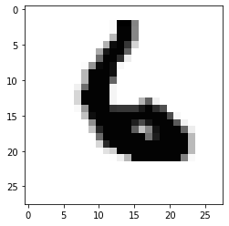
          </p>
      
       - Result
          
           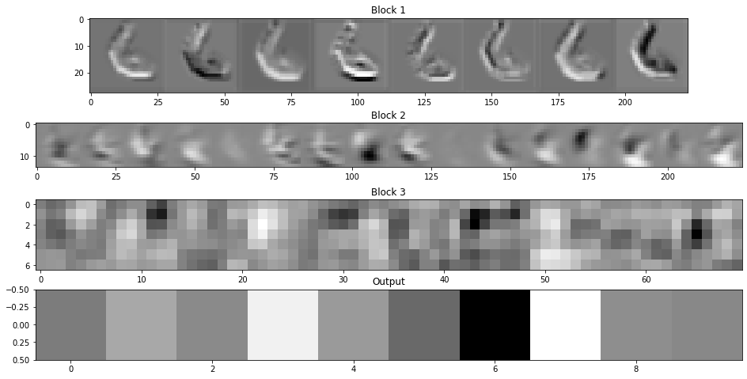
 
- **Experiment 2**
   - Strategy
       - Using the previous model as a baseline
       - Introduction of **Batch Normalization Layer** layer
   - Architecture
 
       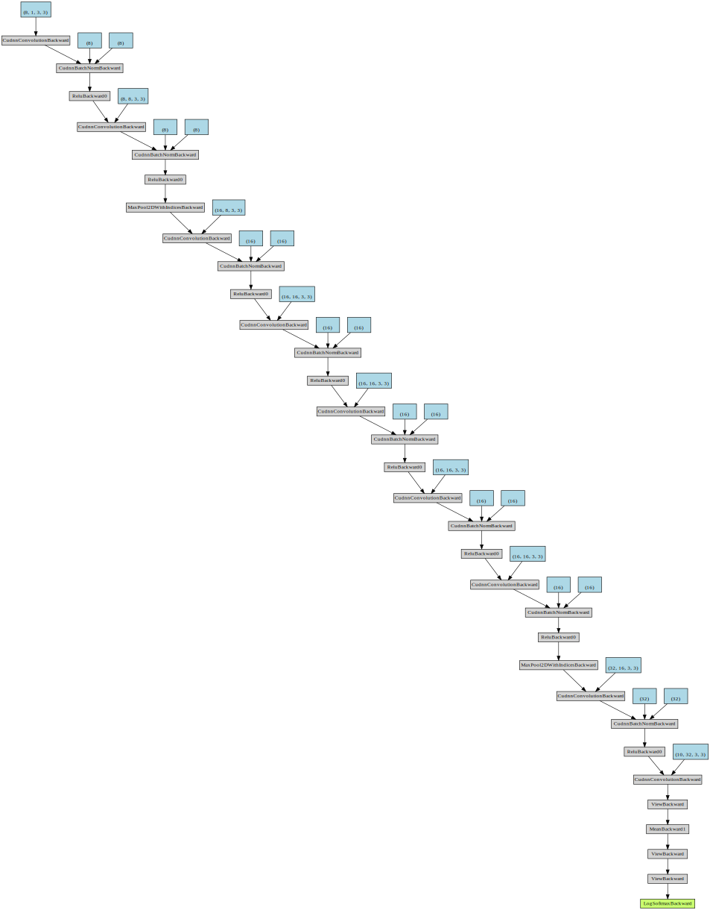
 
   - Logs
       ```
       TRAIN : epoch=0 train_loss=0.00407 correct/total=55292/60000 accuracy=92.2: 100%|██████████| 938/938 [00:25<00:00, 37.36it/s]
       TEST :  epoch=0 test_loss=0.12327 correct/total=9607/10000 accuracy=96.1: 100%|██████████| 157/157 [00:03<00:00, 44.56it/s]
       TRAIN : epoch=1 train_loss=0.00087 correct/total=58966/60000 accuracy=98.3: 100%|██████████| 938/938 [00:25<00:00, 36.76it/s]
       TEST :  epoch=1 test_loss=0.03799 correct/total=9884/10000 accuracy=98.8: 100%|██████████| 157/157 [00:04<00:00, 39.02it/s]
       TRAIN : epoch=2 train_loss=0.00064 correct/total=59219/60000 accuracy=98.7: 100%|██████████| 938/938 [00:25<00:00, 37.24it/s]
       TEST :  epoch=2 test_loss=0.03343 correct/total=9899/10000 accuracy=99.0: 100%|██████████| 157/157 [00:03<00:00, 45.34it/s]
       TRAIN : epoch=3 train_loss=0.00050 correct/total=59392/60000 accuracy=99.0: 100%|██████████| 938/938 [00:24<00:00, 37.60it/s]
       TEST :  epoch=3 test_loss=0.04116 correct/total=9882/10000 accuracy=98.8: 100%|██████████| 157/157 [00:03<00:00, 44.30it/s]
       TRAIN : epoch=4 train_loss=0.00045 correct/total=59451/60000 accuracy=99.1: 100%|██████████| 938/938 [00:24<00:00, 37.86it/s]
       TEST :  epoch=4 test_loss=0.03416 correct/total=9891/10000 accuracy=98.9: 100%|██████████| 157/157 [00:03<00:00, 45.04it/s]
       TRAIN : epoch=5 train_loss=0.00040 correct/total=59503/60000 accuracy=99.2: 100%|██████████| 938/938 [00:25<00:00, 37.24it/s]
       TEST :  epoch=5 test_loss=0.02478 correct/total=9919/10000 accuracy=99.2: 100%|██████████| 157/157 [00:03<00:00, 44.63it/s]
       TRAIN : epoch=6 train_loss=0.00035 correct/total=59580/60000 accuracy=99.3: 100%|██████████| 938/938 [00:25<00:00, 37.45it/s]
       TEST :  epoch=6 test_loss=0.04377 correct/total=9859/10000 accuracy=98.6: 100%|██████████| 157/157 [00:03<00:00, 43.59it/s]
       TRAIN : epoch=7 train_loss=0.00031 correct/total=59624/60000 accuracy=99.4: 100%|██████████| 938/938 [00:25<00:00, 37.18it/s]
       TEST :  epoch=7 test_loss=0.02668 correct/total=9915/10000 accuracy=99.2: 100%|██████████| 157/157 [00:03<00:00, 43.38it/s]
       TRAIN : epoch=8 train_loss=0.00029 correct/total=59625/60000 accuracy=99.4: 100%|██████████| 938/938 [00:25<00:00, 37.19it/s]
       TEST :  epoch=8 test_loss=0.02661 correct/total=9914/10000 accuracy=99.1: 100%|██████████| 157/157 [00:03<00:00, 44.94it/s]
       TRAIN : epoch=9 train_loss=0.00026 correct/total=59683/60000 accuracy=99.5: 100%|██████████| 938/938 [00:25<00:00, 37.01it/s]
       TEST :  epoch=9 test_loss=0.02235 correct/total=9927/10000 accuracy=99.3: 100%|██████████| 157/157 [00:03<00:00, 43.85it/s]
       TRAIN : epoch=10 train_loss=0.00024 correct/total=59723/60000 accuracy=99.5: 100%|██████████| 938/938 [00:25<00:00, 37.08it/s]
       TEST :  epoch=10 test_loss=0.02570 correct/total=9915/10000 accuracy=99.2: 100%|██████████| 157/157 [00:03<00:00, 44.08it/s]
       TRAIN : epoch=11 train_loss=0.00022 correct/total=59723/60000 accuracy=99.5: 100%|██████████| 938/938 [00:25<00:00, 36.91it/s]
       TEST :  epoch=11 test_loss=0.02660 correct/total=9919/10000 accuracy=99.2: 100%|██████████| 157/157 [00:03<00:00, 44.17it/s]
       TRAIN : epoch=12 train_loss=0.00019 correct/total=59772/60000 accuracy=99.6: 100%|██████████| 938/938 [00:25<00:00, 36.78it/s]
       TEST :  epoch=12 test_loss=0.02320 correct/total=9925/10000 accuracy=99.2: 100%|██████████| 157/157 [00:03<00:00, 44.86it/s]
       TRAIN : epoch=13 train_loss=0.00017 correct/total=59800/60000 accuracy=99.7: 100%|██████████| 938/938 [00:25<00:00, 36.94it/s]
       TEST :  epoch=13 test_loss=0.02802 correct/total=9921/10000 accuracy=99.2: 100%|██████████| 157/157 [00:03<00:00, 43.86it/s]
       TRAIN : epoch=14 train_loss=0.00018 correct/total=59783/60000 accuracy=99.6: 100%|██████████| 938/938 [00:25<00:00, 37.01it/s]
       TEST :  epoch=14 test_loss=0.02488 correct/total=9918/10000 accuracy=99.2: 100%|██████████| 157/157 [00:03<00:00, 44.45it/s]
       TRAIN : epoch=15 train_loss=0.00015 correct/total=59821/60000 accuracy=99.7: 100%|██████████| 938/938 [00:25<00:00, 36.99it/s]
       TEST :  epoch=15 test_loss=0.02094 correct/total=9926/10000 accuracy=99.3: 100%|██████████| 157/157 [00:03<00:00, 42.53it/s]
       TRAIN : epoch=16 train_loss=0.00017 correct/total=59798/60000 accuracy=99.7: 100%|██████████| 938/938 [00:25<00:00, 37.44it/s]
       TEST :  epoch=16 test_loss=0.02433 correct/total=9924/10000 accuracy=99.2: 100%|██████████| 157/157 [00:03<00:00, 44.24it/s]
       TRAIN : epoch=17 train_loss=0.00016 correct/total=59803/60000 accuracy=99.7: 100%|██████████| 938/938 [00:25<00:00, 37.22it/s]
       TEST :  epoch=17 test_loss=0.02331 correct/total=9922/10000 accuracy=99.2: 100%|██████████| 157/157 [00:03<00:00, 43.33it/s]
       TRAIN : epoch=18 train_loss=0.00013 correct/total=59850/60000 accuracy=99.8: 100%|██████████| 938/938 [00:25<00:00, 37.23it/s]
       TEST :  epoch=18 test_loss=0.02357 correct/total=9926/10000 accuracy=99.3: 100%|██████████| 157/157 [00:03<00:00, 44.77it/s]
       TRAIN : epoch=19 train_loss=0.00010 correct/total=59886/60000 accuracy=99.8: 100%|██████████| 938/938 [00:25<00:00, 37.37it/s]
       TEST :  epoch=19 test_loss=0.02206 correct/total=9933/10000 accuracy=99.3: 100%|██████████| 157/157 [00:03<00:00, 44.26it/s]
       ```
 
   - Results
     - Feature Visualization
       - Input image
          
          <p align="center">
           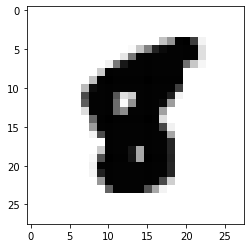
          </p>
      
       - Result
          
           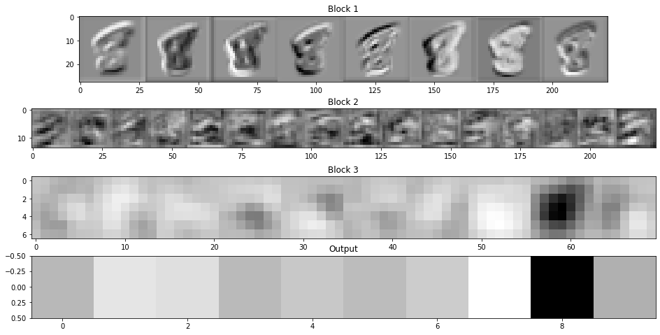
 
- **Experiment 3**
   - Strategy
       - Using the previous model as a baseline
       - Introduction of **Dropout Layer** layer
   - Architecture
 
       
 
   - Logs
       ```
       TRAIN : epoch=0 train_loss=0.00829 correct/total=49018/60000 accuracy=81.7: 100%|██████████| 938/938 [00:25<00:00, 36.14it/s]
       TEST :  epoch=0 test_loss=0.06391 correct/total=9817/10000 accuracy=98.2: 100%|██████████| 157/157 [00:03<00:00, 43.31it/s]
       TRAIN : epoch=1 train_loss=0.00278 correct/total=55945/60000 accuracy=93.2: 100%|██████████| 938/938 [00:26<00:00, 35.77it/s]
       TEST :  epoch=1 test_loss=0.03780 correct/total=9875/10000 accuracy=98.8: 100%|██████████| 157/157 [00:03<00:00, 39.82it/s]
       TRAIN : epoch=2 train_loss=0.00226 correct/total=56480/60000 accuracy=94.1: 100%|██████████| 938/938 [00:25<00:00, 36.16it/s]
       TEST :  epoch=2 test_loss=0.04183 correct/total=9869/10000 accuracy=98.7: 100%|██████████| 157/157 [00:03<00:00, 43.72it/s]
       TRAIN : epoch=3 train_loss=0.00207 correct/total=56677/60000 accuracy=94.5: 100%|██████████| 938/938 [00:25<00:00, 36.40it/s]
       TEST :  epoch=3 test_loss=0.02509 correct/total=9915/10000 accuracy=99.2: 100%|██████████| 157/157 [00:03<00:00, 44.85it/s]
       TRAIN : epoch=4 train_loss=0.00184 correct/total=56806/60000 accuracy=94.7: 100%|██████████| 938/938 [00:26<00:00, 37.08it/s]
       TEST :  epoch=4 test_loss=0.02265 correct/total=9929/10000 accuracy=99.3: 100%|██████████| 157/157 [00:03<00:00, 43.31it/s]
       TRAIN : epoch=5 train_loss=0.00178 correct/total=56884/60000 accuracy=94.8: 100%|██████████| 938/938 [00:25<00:00, 36.19it/s]
       TEST :  epoch=5 test_loss=0.02280 correct/total=9926/10000 accuracy=99.3: 100%|██████████| 157/157 [00:03<00:00, 43.94it/s]
       TRAIN : epoch=6 train_loss=0.00171 correct/total=56965/60000 accuracy=94.9: 100%|██████████| 938/938 [00:25<00:00, 36.24it/s]
       TEST :  epoch=6 test_loss=0.02802 correct/total=9912/10000 accuracy=99.1: 100%|██████████| 157/157 [00:03<00:00, 43.03it/s]
       TRAIN : epoch=7 train_loss=0.00165 correct/total=57029/60000 accuracy=95.0: 100%|██████████| 938/938 [00:26<00:00, 36.03it/s]
       TEST :  epoch=7 test_loss=0.02358 correct/total=9920/10000 accuracy=99.2: 100%|██████████| 157/157 [00:03<00:00, 43.53it/s]
       TRAIN : epoch=8 train_loss=0.00160 correct/total=57108/60000 accuracy=95.2: 100%|██████████| 938/938 [00:25<00:00, 36.35it/s]
       TEST :  epoch=8 test_loss=0.02459 correct/total=9913/10000 accuracy=99.1: 100%|██████████| 157/157 [00:03<00:00, 43.52it/s]
       TRAIN : epoch=9 train_loss=0.00154 correct/total=57165/60000 accuracy=95.3: 100%|██████████| 938/938 [00:25<00:00, 36.14it/s]
       TEST :  epoch=9 test_loss=0.02292 correct/total=9921/10000 accuracy=99.2: 100%|██████████| 157/157 [00:03<00:00, 43.41it/s]
       TRAIN : epoch=10 train_loss=0.00153 correct/total=57259/60000 accuracy=95.4: 100%|██████████| 938/938 [00:25<00:00, 36.13it/s]
       TEST :  epoch=10 test_loss=0.02019 correct/total=9935/10000 accuracy=99.3: 100%|██████████| 157/157 [00:03<00:00, 42.63it/s]
       TRAIN : epoch=11 train_loss=0.00149 correct/total=57251/60000 accuracy=95.4: 100%|██████████| 938/938 [00:26<00:00, 35.97it/s]
       TEST :  epoch=11 test_loss=0.02078 correct/total=9938/10000 accuracy=99.4: 100%|██████████| 157/157 [00:03<00:00, 43.56it/s]
       TRAIN : epoch=12 train_loss=0.00150 correct/total=57170/60000 accuracy=95.3: 100%|██████████| 938/938 [00:25<00:00, 36.21it/s]
       TEST :  epoch=12 test_loss=0.01897 correct/total=9945/10000 accuracy=99.5: 100%|██████████| 157/157 [00:03<00:00, 43.98it/s]
       TRAIN : epoch=13 train_loss=0.00144 correct/total=57314/60000 accuracy=95.5: 100%|██████████| 938/938 [00:26<00:00, 35.91it/s]
       TEST :  epoch=13 test_loss=0.02195 correct/total=9936/10000 accuracy=99.4: 100%|██████████| 157/157 [00:03<00:00, 44.03it/s]
       TRAIN : epoch=14 train_loss=0.00141 correct/total=57327/60000 accuracy=95.5: 100%|██████████| 938/938 [00:26<00:00, 35.99it/s]
       TEST :  epoch=14 test_loss=0.01686 correct/total=9945/10000 accuracy=99.5: 100%|██████████| 157/157 [00:03<00:00, 43.45it/s]
       TRAIN : epoch=15 train_loss=0.00138 correct/total=57326/60000 accuracy=95.5: 100%|██████████| 938/938 [00:25<00:00, 36.10it/s]
       TEST :  epoch=15 test_loss=0.01996 correct/total=9936/10000 accuracy=99.4: 100%|██████████| 157/157 [00:03<00:00, 42.95it/s]
       TRAIN : epoch=16 train_loss=0.00138 correct/total=57362/60000 accuracy=95.6: 100%|██████████| 938/938 [00:25<00:00, 36.15it/s]
       TEST :  epoch=16 test_loss=0.01674 correct/total=9943/10000 accuracy=99.4: 100%|██████████| 157/157 [00:03<00:00, 43.98it/s]
       TRAIN : epoch=17 train_loss=0.00136 correct/total=57305/60000 accuracy=95.5: 100%|██████████| 938/938 [00:26<00:00, 35.65it/s]
       TEST :  epoch=17 test_loss=0.01787 correct/total=9943/10000 accuracy=99.4: 100%|██████████| 157/157 [00:03<00:00, 43.03it/s]
       TRAIN : epoch=18 train_loss=0.00135 correct/total=57361/60000 accuracy=95.6: 100%|██████████| 938/938 [00:26<00:00, 36.05it/s]
       TEST :  epoch=18 test_loss=0.01990 correct/total=9936/10000 accuracy=99.4: 100%|██████████| 157/157 [00:03<00:00, 43.27it/s]
       TRAIN : epoch=19 train_loss=0.00128 correct/total=57416/60000 accuracy=95.7: 100%|██████████| 938/938 [00:26<00:00, 36.02it/s]
       TEST :  epoch=19 test_loss=0.01839 correct/total=9945/10000 accuracy=99.5: 100%|██████████| 157/157 [00:03<00:00, 42.44it/s]
       ```
 
   - Results
     - Feature Visualization
       - Input image
 
          <p align="center">
           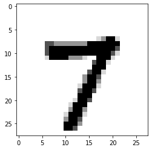
          </p>
      
       - Result
          
           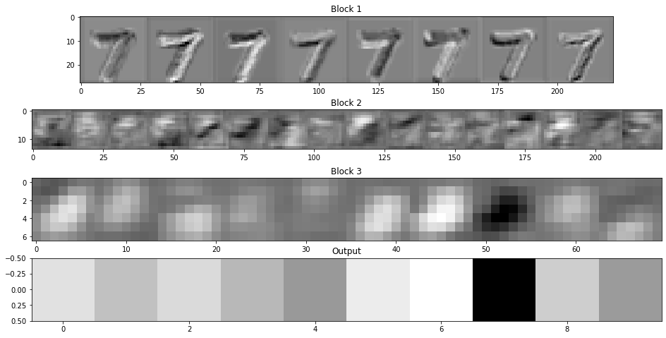
 
 
### Results
- Loss analysis
   - Total loss
 
   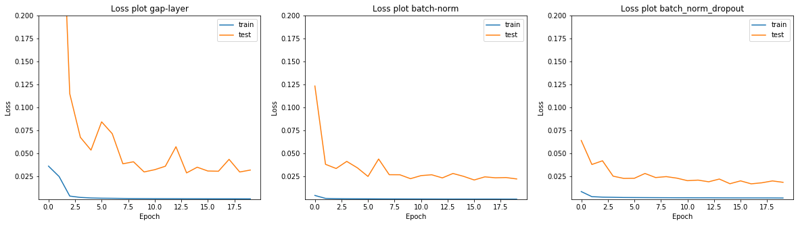
 
   - Batch loss
  
   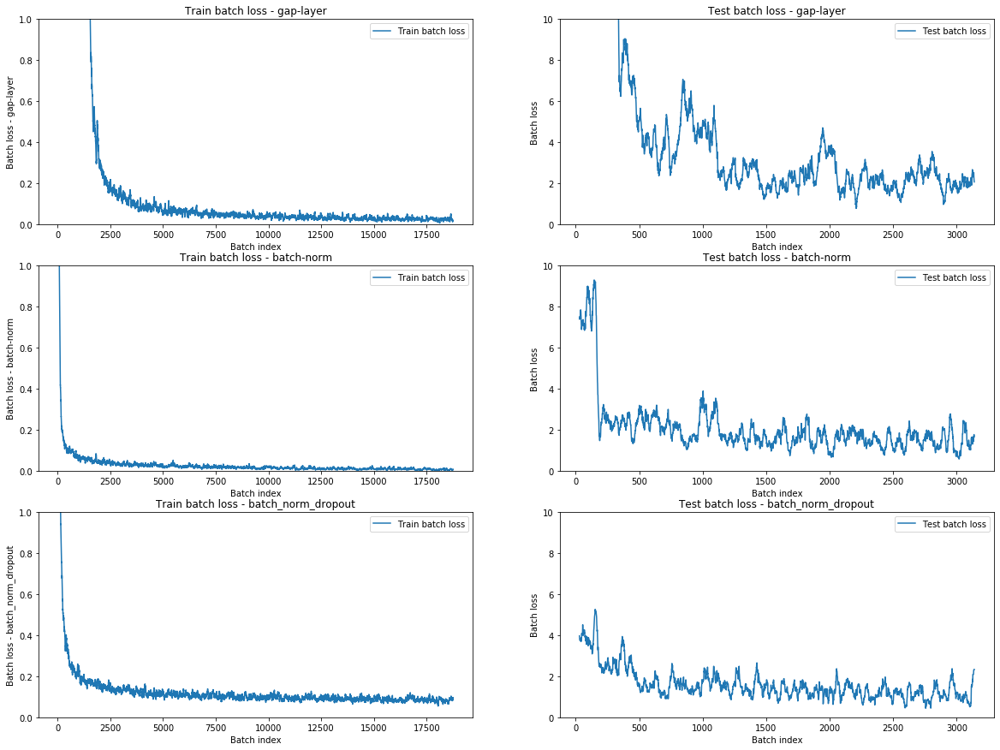
      
   - Inferences
       -   _Experiment 1_ take good number of epochs to start converging due to lack of any regularization in the network
 
       -   In case of the _Experiment 2_, it can be observed that the loss values are pretty low and still it struggled to touch **99.4%** validation accuracy showing signs of **overfitting**
 
       -   _Experiment 3_ strikes balance between overfitting and slow convergence with significant improvements in accuracy touching **99.4%** accuracy multiple times.
 
- Accuracy analysis
 
   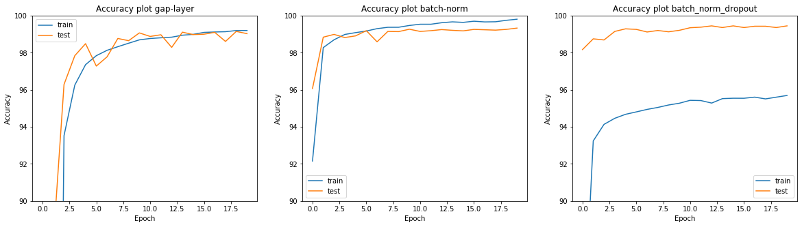
 
   - Inferences
 
       -   In case of the _Experiment 2_, as previously stated in case of the loss function, it can be observed to overfit tremendously as train accuracy can be observed to be way higher than test accuracy majority of the time.
 
       -   Introduction of Dropout in _Experiment 3_ enabled slow training and better generalization resulting in better accuracies.

# Assignment 5

## Submitted by
    - Siva Sankar Anil Kumar
    - Dinesh Kesaboina
 
### The assignment is divided into 5 steps
 
- Step 1
    - Setting up the work flow
        | Metric | Value |
        | - | - |
        | _Best train accuracy_| **99.4** |
        | _Best test accuracy_| **99.2** |
        | _Best epoch number_| **12** |
        | _Parameter count_ | **194,884** |

- Step 2
    - Brute force minimization of the number of parameters
        | Metric | Value |
        | - | - |
        | _Best train accuracy_| **98.2** |
        | _Best test accuracy_| **98.4** |
        | _Best epoch number_| **9** |
        | _Parameter count_ | **8,040** |

- Step 3
    - Introduce batch-norm and dropout
        | Metric | Value |
        | - | - |
        | _Best train accuracy_| **98.7** |
        | _Best test accuracy_| **99.2** |
        | _Best epoch number_| **8** |
        | _Parameter count_ | **8,172** |

- Step 4
    - Introduce GAP layer and blow up parameter count
        | Metric | Value |
        | - | - |
        | _Best train accuracy_| **99.10** |
        | _Best test accuracy_| **99.44** |
        | _Best epoch number_| **14** |
        | _Parameter count_ | **9,608** |

- Step 5
    - Add image augmentation and lr scheduling
        | Metric | Value |
        | - | - |
        | _Best train accuracy_| **99.05** |
        | _Best test accuracy_| **99.46** |
        | _Best epoch number_| **14** |
        | _Parameter count_ | **9,608** |